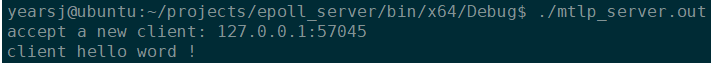
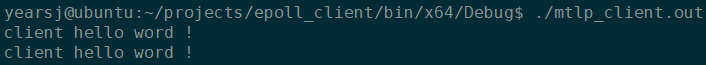

# IO多路复用（二） -- select、poll、epoll实现TCP反射程序

接着上文[IO多路复用（一）-- Select、Poll、Epoll](https://segmentfault.com/a/1190000016400053)，接下来将演示一个TCP回射程序，源代码来自于该博文https://www.cnblogs.com/Anker/p/3258674.html 博主的几篇相关的文章，在这里将其进行了整合，突出select、poll和epoll不同方法之间的比较，但是代码的结构相同，为了突出方法之间的差别，可能有的代码改动的并不合理，实际中使用并非这么写。

## 程序逻辑

该程序的主要逻辑如下：

```c
服务器：
	1. 开启服务器套接字
	2. 将服务器套接字加入要监听的集合中（select的fd_set、poll的pollfd、epoll调用epoll_ctl）
	3. 进入循环，调用IO多路复用的API函数（select/poll/epoll_create），如果有事件产生：
		3.1. 服务器套接字产生的事件，添加新的客户端到监听集合中
		3.2. 客户端套接字产生的事件，读取数据，并立马回传给客户端
		
客户端：
	1. 开启客户端套接字
	2. 将客户端套接字和标准输入文件描述符加入要监听的集合中（select的fd_set、poll的pollfd、epoll调用epoll_ctl）
	3. 进入循环，调用IO多路复用的API函数（select/poll/epoll_create），如果有事件产生：
		3.1. 客户端套接字产生的事件，则读取数据，将其输出到控制台
		3.2. 标准输入文件描述符产生的事件，则读取数据，将其通过客户端套接字传给服务器
```

## 运行结果

服务端：



客户端：




## 参考资料

[IO多路复用之select总结](https://www.cnblogs.com/Anker/p/3258674.html)

[IO多路复用之poll总结](https://www.cnblogs.com/Anker/p/3261006.html)

[IO多路复用之epoll总结](https://www.cnblogs.com/Anker/p/3263780.html)

> 作者：[yearsj](https://segmentfault.com/u/yearsj)
>
> 转载请注明出处：https://segmentfault.com/a/1190000016400053
